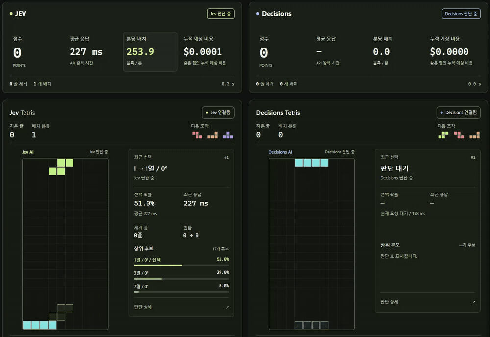
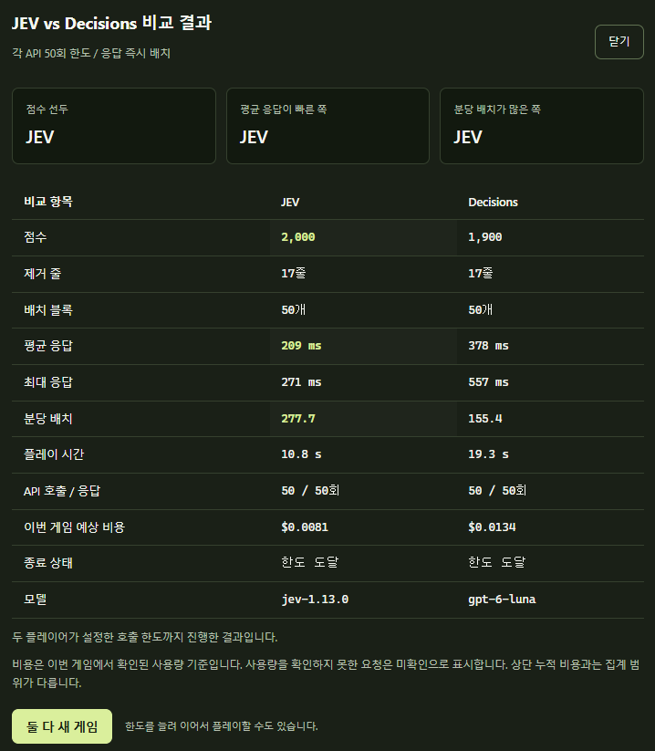

# JEV vs Decisions Tetris

[TypeSafe의 JEV](https://typesafe.ai)와 [OpenAI Decisions API](https://developers.openai.com/api/docs/guides/decisions)가 테트리스를 동시에 플레이하는 비교 실험입니다. 두 보드에 같은 조각 순서를 제공하고, 점수와 응답 속도, 예상 비용을 나란히 확인합니다.

응답이 끝나면 바로 블록을 놓고 다음 요청을 보냅니다. 빠른 쪽은 상대를 기다리지 않으므로 같은 조각이 서로 다른 시점에 등장합니다.

## 비교 영상과 결과

[](docs/media/jev-decision.mp4)

10초 미리보기 / 원본 앞부분을 2배속으로 재생합니다. 이미지를 클릭하면 전체 영상을 볼 수 있습니다.

[전체 비교 영상 보기](docs/media/jev-decision.mp4)

아래는 **각 API 50회 호출 / 응답 즉시 배치**로 진행한 한 번의 실행 결과입니다.



| 항목 | JEV | Decisions |
| --- | ---: | ---: |
| 모델 | `jev-1.13.0` | `gpt-6-luna` |
| 점수 | **2,000** | 1,900 |
| 제거 줄 | 17줄 | 17줄 |
| 배치 블록 | 50개 | 50개 |
| 평균 API 응답 | **209 ms** | 378 ms |
| 최대 API 응답 | 271 ms | 557 ms |
| 분당 배치 | **277.7개** | 155.4개 |
| 플레이 시간 | 10.8 s | 19.3 s |
| API 호출 / 응답 | 50 / 50회 | 50 / 50회 |
| 이번 게임 예상 비용 | **$0.0081** | $0.0134 |
| 종료 상태 | 한도 도달 | 한도 도달 |

이 실행에서는 JEV가 더 짧은 시간과 낮은 예상 비용으로 100점 더 높은 점수를 기록했습니다. 두 모델의 선택에 따라 보드와 이후 입력이 달라집니다. 같은 조각 순서를 사용하지만 매 요청의 보드 상태나 토큰 수까지 같지는 않으며, 이 결과는 특정 조각 순서와 실행 환경에서 얻은 단일 사례입니다.

## 실행하기

Node.js 22.9 이상이 필요합니다. 별도 패키지 설치는 없습니다.

1. `.env.example`을 `.env`로 복사합니다.
2. [TypeSafe 콘솔](https://console.typesafe.ai)과 [OpenAI 플랫폼](https://platform.openai.com/api-keys)에서 발급한 키를 입력합니다.

```dotenv
TYPESAFE_API_KEY=your_typesafe_api_key
TYPESAFE_MODEL=jev-latest
OPENAI_API_KEY=your_openai_api_key
OPENAI_DECISIONS_MODEL=gpt-6-luna
PORT=3000
```

```sh
npm start
```

[localhost:3000](http://localhost:3000)을 열고 **동시에 시작 / 계속**을 누릅니다. 연결된 플레이어만 시작하며, 각 보드에서 따로 시작하거나 멈출 수도 있습니다.

`.env` 대신 각 보드의 연결 버튼으로 키를 입력할 수 있습니다. 화면에서 입력한 키는 해당 탭의 메모리에만 보관되고 새로고침하면 지워집니다. 서버의 `.env` 키가 우선 사용됩니다. 서버 설정이나 판단 코드를 바꾸면 서버를 재시작하세요.

기본 JEV 설정은 `jev-latest`입니다. 영상과 같은 버전을 지정하려면 `TYPESAFE_MODEL=jev-1.13.0`으로 설정합니다. 새 게임마다 조각 순서는 새로 생성되므로 영상의 결과가 그대로 재현되지는 않습니다.

## 비교 방식

두 플레이어는 공통 7-bag 조각 순서와 별도의 보드를 사용합니다. 7-bag은 일곱 종류의 조각을 한 번씩 섞어 공급하는 방식입니다. API 요청은 플레이어별로 하나씩 진행하며 두 API는 서로 독립적으로 호출됩니다.

| 설정 | 동작 |
| --- | --- |
| 응답 즉시 배치 | 판단을 기다린 뒤 즉시 배치하고 다음 요청을 보냅니다. 기본 모드입니다. |
| 중력 낙하 | 응답을 기다리는 동안에도 블록이 내려갑니다. 늦은 선택은 실행되지 못할 수 있습니다. |
| API 호출 한도 | 각 플레이어에 따로 적용합니다. 기본 50회이며 25회, 100회, 무제한으로 변경할 수 있습니다. |
| 둘 다 새 게임 | 두 보드와 공통 조각 순서를 초기화합니다. |
| 개별 새 게임 | 해당 플레이어만 공통 조각 순서의 처음부터 다시 시작합니다. |

한쪽이 한도에 도달하거나 게임 종료 또는 오류로 멈춰도 다른 쪽은 계속 플레이합니다. 두 플레이어가 모두 종료되면 **비교 결과 모달**이 열립니다. 점수, 평균 및 최대 응답, 분당 배치, 호출 수와 이번 게임 예상 비용을 보여주며, 닫은 결과는 **결과 보기**로 다시 열 수 있습니다. 한도를 늘려 이어서 플레이할 수도 있습니다.

## 모델이 판단하는 것

게임 코드가 가능한 착지 위치를 계산하고, 모델이 그중 하나를 선택합니다. JEV와 Decisions는 같은 정보 구성과 판단 기준을 사용하며 각 API의 형식에 맞춰 전달합니다.

- 현재 보드 전체와 현재 조각, 다음 조각 순서, 조각별 회전 모양
- 후보별 배치 후 보드, 제거 줄, 구멍 수, 열별 높이와 다음 조각의 진입 가능 여부
- 각 후보에 다음 조각 한 개를 놓아본 결과와 가능한 후속 배치 예시

현재 가능한 후보를 모두 전달하고, 모델이 고른 배치를 별도의 점수 공식으로 바꾸지 않습니다. 모델이 선택한 위치에 블록을 놓은 뒤 다음 판단으로 넘어갑니다. 후속 배치 예시는 미래의 가능한 결과이며 현재 점수나 제거 줄에 포함하지 않습니다.

JEV는 `POST /v1/systemone`, Decisions는 `POST /v1/decisions`의 `choice` 질문을 사용합니다. 현재 구현은 보드와 후보를 **텍스트로 전달**합니다. 화면 이미지를 모델에 보내지는 않습니다.

보드 표현에서 `#`는 블록, `.`는 위가 열린 빈칸, `o`는 같은 열의 블록 아래에 가려진 빈칸입니다. 화면에서 후보별 선택 확률과 배치 기록을 확인할 수 있습니다. 선택 확률은 후보 사이의 분포이며 게임 승률을 뜻하지 않습니다. 홀드와 벽 차기 회전(SRS)은 구현하지 않은 간소화된 테트리스입니다.

## 속도와 비용 계산

| 지표 | 계산 기준 |
| --- | --- |
| 점수 | 한 번에 1 / 2 / 3 / 4줄을 제거하면 100 / 300 / 500 / 800점 |
| 평균 API 응답 | 정상적으로 받은 판단의 서버 측 응답 시간 평균. 서버와 API 사이의 네트워크 왕복과 응답 처리를 포함합니다. |
| 최대 API 응답 | 같은 응답 기록에서 가장 오래 걸린 시간 |
| 분당 배치 | 배치한 블록 수 × 60,000 ÷ 실제 플레이 시간(ms). 일시 정지 시간은 제외하고 요청 대기와 화면 처리, 배치 시간은 포함합니다. |
| 예상 비용 | 각 응답에서 확인된 입력 토큰 수 × 해당 모델의 입력 단가를 합산 |

2026-10-07 확인 기준으로 입력 100만 토큰당 JEV `jev-1.13.0`은 **$0.042**, Decisions `gpt-6-luna`는 **$0.10**입니다. 두 API 모두 출력 토큰은 무료입니다. 단가는 [TypeSafe 모델 문서](https://docs.typesafe.ai/models)와 [OpenAI Decisions 가격 안내](https://developers.openai.com/api/docs/guides/decisions#pricing-and-availability)를 기준으로 합니다.

상단의 **누적 예상 비용**은 같은 탭에서 새 게임과 새로고침 후에도 유지됩니다. 결과 모달의 **이번 게임 예상 비용**은 해당 게임만 집계합니다. 사용량을 확인하지 못한 요청은 미확인으로 표시하며, 지역 처리와 긴 컨텍스트 할증은 계산하지 않습니다. 실제 청구액과 다를 수 있습니다.

## 개발과 검증

```sh
npm test
```

테스트에는 API 키가 필요 없습니다. Windows 샌드박스에서 자식 프로세스 생성이 제한되면 다음 명령을 사용할 수 있습니다.

```sh
node --test --test-isolation=none
```

`eval/browser-check.mjs`는 모의 API 응답으로 동시 플레이, 독립적인 속도, 공통 조각 순서, 정지와 초기화, 오류 처리, 비용 표시, 결과 모달과 모바일 배치를 확인합니다. 별도로 설치된 Playwright의 모듈 경로를 `PLAYWRIGHT_MODULE`, Chromium 실행 파일 경로를 `CHROMIUM_PATH`에 지정한 뒤 실행합니다. 실제 API는 호출하지 않습니다.

```sh
node eval/browser-check.mjs
```

| 파일 | 역할 |
| --- | --- |
| [server.mjs](server.mjs) | 로컬 서버와 API 요청 중계 |
| [jev.mjs](jev.mjs) | 공통 판단 입력과 JEV 호출 |
| [decisions.mjs](decisions.mjs) | Decisions 요청 형식 변환과 호출 |
| [public/engine.mjs](public/engine.mjs) | 테트리스 규칙과 배치 후보 계산 |
| [public/app.mjs](public/app.mjs) | 두 플레이어 실행과 비교 화면 |
| [public/analysis.mjs](public/analysis.mjs) | 확률 표시와 예상 비용 계산 |

기존 JEV 입력 변경 실험은 [구현과 실험 기록](docs/implementation.md)에 정리되어 있습니다. `eval/compare.mjs --full-board`와 `--games`는 JEV의 입력 구성을 비교하는 별도 실험이며 실제 API를 호출합니다. 브라우저의 호출 한도와 비용 집계에는 포함되지 않습니다.

[이전 JEV 단독 플레이 영상](docs/media/jev-tetris-demo.mp4)
