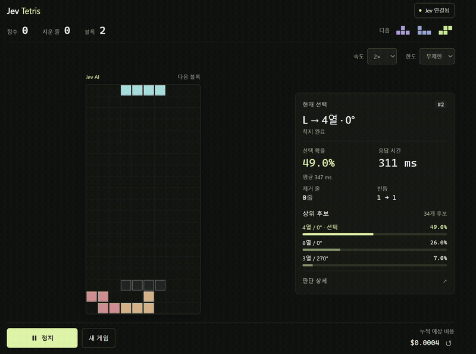

# Jev Tetris

[TypeSafe의 Jev](https://typesafe.ai)가 테트리스를 플레이하는 작은 실험입니다.
가능한 배치와 그 결과를 보내면, Jev가 놓을 위치를 고릅니다.

[](docs/media/jev-tetris-demo.mp4)

[전체 영상 · 19초](docs/media/jev-tetris-demo.mp4)

## Jev가 하는 일

게임 코드는 가능한 착지 위치와 배치 후 빈틈·높이·제거 줄 수를 계산합니다. Jev는 이 정보를 받아 배치 하나를 선택하고, 게임은 그 위치로 이동한 뒤 하드드롭합니다.

화면에서 후보별 확률, API 응답 시간, 누적 예상 비용을 함께 볼 수 있습니다. 확률은 후보 사이의 선택 확률이며 승률은 아닙니다. 홀드·벽 차기 회전(SRS)은 없는 간소화된 테트리스입니다.

## 실행

Node.js 22.9 이상과 [TypeSafe API 키](https://console.typesafe.ai)가 필요합니다. 별도 패키지 설치는 없습니다.

```sh
node --env-file-if-exists=.env server.mjs
```

[localhost:3000](http://localhost:3000)을 열고 **Jev 연결 → 키 입력 → 시작**을 누르세요. 화면에서 입력한 키는 새로고침하면 지워집니다.

`.env.example`을 `.env`로 복사해 `TYPESAFE_API_KEY`를 넣으면 자동 연결됩니다. 서버의 키가 우선 사용되므로, 공개 서버에서 방문자가 각자 키를 입력하게 하려면 비워두세요.

## 개발

```sh
node --test
```

테스트에는 API 키가 필요 없습니다. 프롬프트는 [jev.mjs](jev.mjs), 게임 로직은 [public/engine.mjs](public/engine.mjs)에 있습니다.

[구현과 실험 기록](docs/implementation.md)
